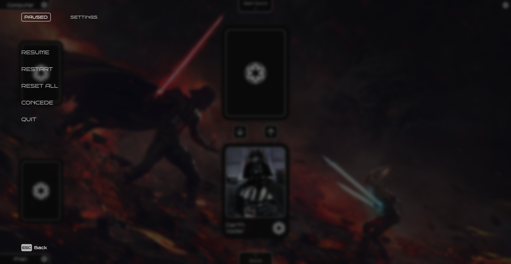

<!-- PROJECT SHIELDS -->

[![Contributors][contributors-shield]][contributors-url]
[![Forks][forks-shield]][forks-url]
[![Stargazers][stars-shield]][stars-url]
[![Issues][issues-shield]][issues-url]
[![MIT License][license-shield]][license-url]
[![LinkedIn][linkedin-shield]][linkedin-url]

<!-- PROJECT LOGO -->

<div align="center">
  

  <h3 align="center">C2-D2 Card Game</h3>
  
  <p align="center">
    Star Wars inspired browser card game built with React and Vite.
    <br>May the Force be with you!
    <br />
    <a href="https://c2-d2.netlify.app/"><strong>Launch Game</strong></a>    
    <br />
    <br />
    <em>⚠️ Desktop only – not optimized for mobile or tablet use.</em>
    <br />
    <a href="https://github.com/FranVlahovic/C2-D2">Docs</a>  
    ·  
    <a href="https://github.com/FranVlahovic/C2-D2/issues/new?labels=bug&template=bug-report---.md">Report Bug</a>  
    ·  
    <a href="https://github.com/FranVlahovic/C2-D2/issues/new?labels=enhancement&template=feature-request---.md">Request Feature</a>  
  </p>
</div>

---

## Table of Contents

- [About The Project](#about-the-project)
- [Features](#features)
- [Gallery](#gallery)
- [Built With](#built-with)
- [Getting Started](#getting-started)
    - [Prerequisites](#prerequisites)
    - [Installation](#installation)
- [Usage](#usage)
- [Contributing](#contributing)
- [License](#license)
- [Contact](#contact)
- [Acknowledgments](#acknowledgments)

---

## About The Project

**C2-D2** is a browser-based card game inspired by the _Star Wars_ universe.
Built with modern web technologies like **React** and **Vite**, it offers a fast and scalable experience.
The game is designed for quick, casual play and easy expansion

---

## Features

### [Start Screen](#start-screen)

The start screen includes a **skip button** for users who have already played before.

---

### [Choosing Name](#creating-in-game-name)

Users can enter an in-game name with **input validation** to ensure proper formatting.

---

### [Choosing Faction](#choosing-faction-1)

Players can choose from **three factions**:

<div style="display: flex; gap: 30px; text-align: center;">
  <div>
    <h3>Jedi Order</h3>
    
  </div>
  <div>
    <h3>Galactic Empire</h3>
    
  </div>
  <div>
    <h3>The Resistance</h3>
    
  </div>
</div>

---

### [Changing Settings](#changing-settings-1)

In-game settings include both a **Paused Submenu** and a **Settings Menu**.

**_Paused Submenu:_**

- **Resume Game**: Continue the current game.
- **Restart Game**: Start a new game from the beginning.
- **Reset Progress**: Erase all saved progress.
- **Concede**: Forfeit the current match.
- **Quit to Main Menu**: Return to the main screen.

**_Settings Menu:_**

- **Profile**: Change your name and faction.
- **Controls**: Switch between mouse and keyboard inputs.
- **Graphics**: Adjust visual settings.
- **Audio**: Enable or disable in-game music and sound effects.
- **Credits**: View acknowledgments for all game resources and contributors.

---

### [Ranking System](#ranking-system-leveling-up)

Players earn ranks based on the number of correct guesses:

| Condition    | Rank    |
| ------------ | ------- |
| Less than 50 | Bronze  |
| 50 to 99     | Silver  |
| 100 to 199   | Gold    |
| 200 or more  | Diamond |

## Gallery

### Videos

<div align="center">  
  <h4>Start Screen</h4>  
  
  <h4>Introduction Screen</h4>  
    
  <h4>Choosing Faction Screen</h4>  
  
  <h4>Gameplay Screen</h4>  
  
  <h4>Game Stats Screen</h4>  
  
  <h4>Game Options Screen</h4>  
  
</div>

---

### Images

#### Start Screen

<div align="left">
  
  
</div>

#### Creating In-Game Name

<div>
  
  
</div>

#### Choosing Faction

<div>  
  
  
</div>

#### Gameplay

<div>
  
  
</div>

#### Changing Settings

<div>
  
  
  
  
  
  
</div>

#### Ranking System (Leveling up)

<div>
  
  
  

</div>

## Built With

<div style="display: flex; gap: 20px; align-items: end;">
  <div style="text-align: center;">
    <a href="https://www.w3schools.com/css/" target="_blank" rel="noreferrer">
      
    </a>
    <div>CSS3</div>
  </div>

  <div style="text-align: center;">
    <a href="https://www.w3.org/html/" target="_blank" rel="noreferrer">
      
    </a>
    <div>HTML5</div>
  </div>

  <div style="text-align: center;">
    <a href="https://developer.mozilla.org/en-US/docs/Web/JavaScript" target="_blank" rel="noreferrer">
      
    </a>
    <div>JavaScript</div>
  </div>

  <div style="text-align: center;">
    <a href="https://reactjs.org/" target="_blank" rel="noreferrer">
      
    </a>
    <div>React</div>
  </div>
</div>

---

## Getting Started

To set up a local copy, follow these steps:

### Prerequisites

- Ensure [Node.js](https://nodejs.org/) is installed.

### Installation

1. Clone the repository:
    ```sh
    git clone https://github.com/FranVlahovic/C2-D2.git
    ```
2. Navigate to the directory:
    ```sh
    cd C2-D2
    ```
3. Install dependencies:
    ```sh
    npm install
    ```

---

## Usage

To start the development environment:

```sh
npm start
```

Build for production:

```sh
npm run build
```

---

## Contributing

Contributions are welcome! To contribute:

1. Fork the repository.
2. Create your branch (`git checkout -b feature/YourFeature`).
3. Commit changes (`git commit -m 'Add your feature'`).
4. Push the branch (`git push origin feature/YourFeature`).
5. Open a pull request.

---

## License

Distributed under the MIT License. See [MIT License]() for details.

---

## Contact

Fran Vlahovic - [LinkedIn](https://linkedin.com/in/franvlahovic)

Email: franvlahovic@proton.me

Project Link: [https://github.com/FranVlahovic/C2-D2](https://github.com/FranVlahovic/C2-D2)

---

## Acknowledgments

- [The Odin Project](https://www.theodinproject.com/)
- [MDN Web Docs](https://developer.mozilla.org/)
- [Pixabay](https://pixabay.com/)
- [Wallhaven](https://wallhaven.cc/)
- [Star Wars API](https://github.com/akabab)

<!-- MARKDOWN LINKS & IMAGES -->

[contributors-shield]: https://img.shields.io/github/contributors/FranVlahovic/Aeris.svg?style=for-the-badge
[contributors-url]: https://github.com/FranVlahovic/Aeris/graphs/contributors
[forks-shield]: https://img.shields.io/github/forks/FranVlahovic/Aeris.svg?style=for-the-badge
[forks-url]: https://github.com/FranVlahovic/Aeris/network/members
[stars-shield]: https://img.shields.io/github/stars/FranVlahovic/Aeris.svg?style=for-the-badge
[stars-url]: https://github.com/FranVlahovic/Aeris/stargazers
[issues-shield]: https://img.shields.io/github/issues/FranVlahovic/Aeris.svg?style=for-the-badge
[issues-url]: https://github.com/FranVlahovic/Aeris/issues
[license-shield]: https://img.shields.io/github/license/FranVlahovic/Aeris.svg?style=for-the-badge
[license-url]: https://github.com/FranVlahovic/Aeris/blob/main/LICENSE
[linkedin-shield]: https://img.shields.io/badge/-LinkedIn-blue.svg?style=for-the-badge&logo=linkedin&logoColor=white
[linkedin-url]: https://linkedin.com/in/franvlahovic

---
